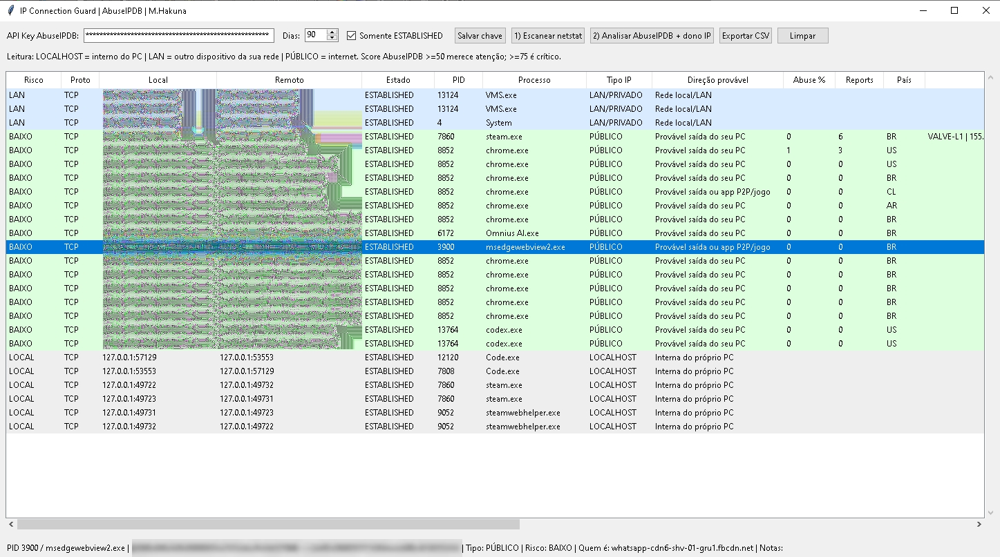
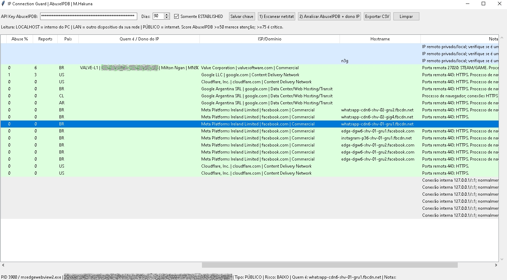

# IP Connection Guard + AbuseIPDB

- App em Python para analisar conexões ativas do Windows usando `netstat -ano`, identificar processos por PID e consultar reputação de IPs públicos no AbuseIPDB.
- Cleyton Lenine - https://www.instagram.com/cleyton.lenine/

## Funções

- Lista conexões ESTABLISHED
- Mostra IP local, IP remoto, porta, estado e PID
- Identifica processo pelo PID
- Classifica IP como LOCALHOST, LAN/PRIVADO ou PÚBLICO
- Consulta AbuseIPDB
- Consulta dono/bloco do IP via RDAP
- Exporta relatório CSV


## OBTER API DO AbuseIPDB
https://www.abuseipdb.com/account/api/keys


<h2>Preview</h2>



## Como usar

crie o exe no CMD com:
pyinstaller --onefile --windowed ip_connection_guard_abuseipdb.py


```cmd
python ip_connection_guard_abuseipdb.py